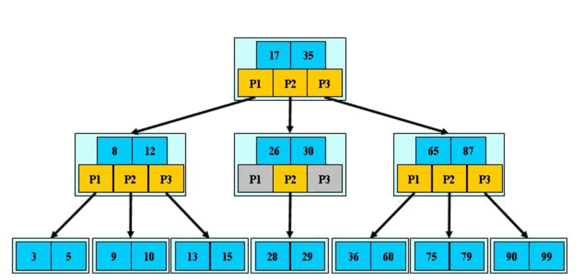

## ElasticSearch核心·倒排索引

> 主要参考自：https://www.cnblogs.com/cjsblog/p/10327673.html

### 通俗的解释

倒排索引（Inverted Index）也叫反向索引，与之相对的就有正向索引。通俗的讲，正向索引通过`key`找`value`，而倒排索引通过`value`找`key` 。

通常我们插入一条索引记录方法如下：

```CQL
curl -X PUT "localhost:9200/user/_doc/1" -H 'Content-Type: application/json' -d'
{
    "name" : "Jack",
    "gender" : 1,
    "age" : 20
}
'
```

可以理解为我们创建了一个名为 `1` 的Document（文档），这个文档有多个Field（字段），比如“name","age"等。

在插入这些数据到索引的同时，ES 还为每个字段建立了索引---倒排索引，

使用倒排索引的几个关键步骤可以归纳如下：


首先，来搞清楚几个概念，为此，举个例子：

假设有个user索引，它有四个字段：分别是name，gender，age，address。画出来的话，大概是下面这个样子，跟关系型数据库一样


**Term（单词）**：<u>一段文本经过分析器分析以后就会输出一串单词</u>  (由此可见分词器对ES的重要性)，这一个一个的就叫做Term（直译为：单词）

**Term Dictionary（单词字典）**：顾名思义，它里面维护的是Term，可以理解为Term的集合

**Term Index（单词索引）**：为了更快的找到某个单词，我们为单词建立索引

**Posting List（倒排列表）**：倒排列表记录了出现过某个单词的所有文档的文档列表及单词在该文档中出现的位置信息，每条记录称为一个倒排项(Posting)。根据倒排列表，即可获知哪些文档包含某个单词。

（PS：实际的倒排列表中并不只是存了文档ID这么简单，还有一些其它的信息，比如：词频（Term出现的次数）、偏移量（offset）等，可以想象成是Python中的元组，或者Java中的对象）

每个文档都有一个ID，如果插入的时候没有指定的话，Elasticsearch会自动生成一个，因此ID字段就不多说了

上面的例子，Elasticsearch建立的索引大致如下：

**name字段：**


**age字段：**


**gender字段：**


**address字段：**


只要知道文档ID，就能快速找到文档。

- [x] 可是，要怎样通过我们给定的关键词快速找到这个Term呢？
- [ ] 不同字段中的相同Term怎么处理？

对于第一个疑问可以为Terms建索引然后使用 B-Tree索引（PS：MySQL就是B树索引最好的例子）。

### B-Tree索引

先回忆下MySQL中的MyISAM存储引擎（此外还有InnoDB存储引擎，两者的对比请参考：[浅谈MySQL存储引擎-InnoDB&MyISAM](https://www.cnblogs.com/liqiangchn/p/9066686.html) ）：




我们查找Term的过程跟在MyISAM中记录ID的过程大致是一样的，MyISAM中，索引和数据是分开，通过索引可以找到记录的地址，进而可以找到这条记录。

在倒排索引中，通过Term索引可以找到Term在Term Dictionary中的位置，进而找到Posting List，有了倒排列表就可以根据ID找到文档了。

